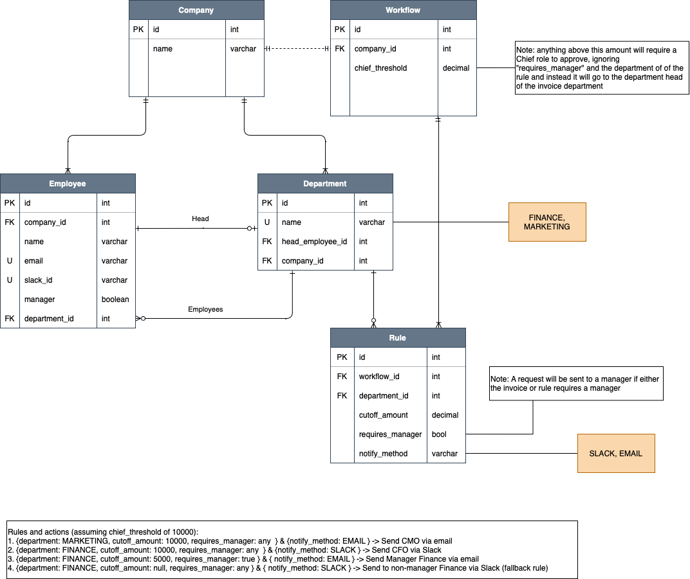

# Approval workflow challenge

### How to build & run with a custom invoice
```sh
./gradlew clean build
./gradlew run --args='1 5000 Finance false'
```

- **arg1** is an _int_ for the `companyId` (already prefilled for _1_)
- **arg2** is a _decimal_ for the `invoiceAmount` in dollars
- **arg3** is an _enum_ for the `department` (_Finance, Marketing_)
- **arg4** is a _bool_ for `manager_approval`

### Assumptions
- We assume every department has at least 1 Chief, 1 manager and 1 regular employee.
- All Chiefs are managers, but not all managers are chiefs,
- When we want to notify a manager specifically we will not notify a chief. The same goes for employees.

### Design:
- A workflow specifies the amount which will always requires a Chief
- If no conditions are met, send the request to any regular `Finance` department employee
- For currencies we use `BigDecimals` in the database and application to maintain precision
- Priority of rules are in ordered in descending order of the `cutoff_amount`
- An approval request will be sent to a manager if either the `invoice` or the `rule` has `true` for `requires_manager`

### Possible Improvements:
- We currently retrieve big data sets from the Database at once, preventing lots of manual lookups. On production a wiser thing could be to split this up into multiple queries to avoid huge memory usage
- The primary keys use auto-incrementing integers but in production probably a `UUID` would be a better idea.
- Currently a rule can only have 1 set of conditions and 1 set of actions but this can be modelled to allow for several conditions and actions per rule.
- Allow for the possibility to assign manual priority per rule
- 
### Database ERD:


### Flowchart:


